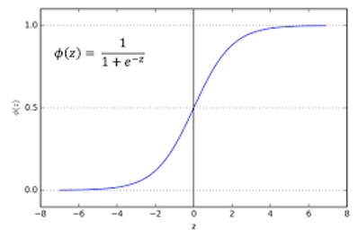
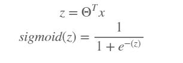
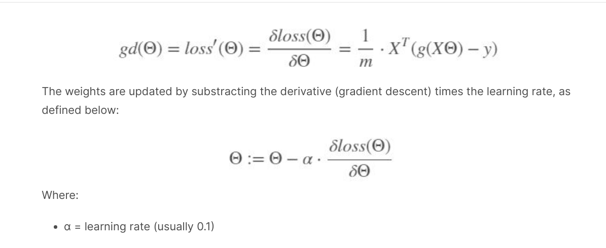

## Logistic Regression
It is a classification algorithm that is used to predict the probability of categorical dependent variable.

### Introduction
*  Logistic regression is named for the function used at the core of the method, the logistic function.
* Logistic regression uses an equation as the representation, very much like linear regression. Input values (X) are combined linearly using weights or coefficient values to predict an output value (y). A key difference from linear regression is that the output value is a discrete rather than continuous.
* Logistic regression model consists of two components: sigmoid function and features with weights:

 - e = Euler's number which is 2.71828.

* The sigmoid function g(z) takes features and weights z as an input and returns a result between 0 and 1. The output of the sigmoid function is an actual prediction ŷ.
* Where z = x1*w1 + ... + xn*wn
* If we plot the sigmoid function we can see curve like this:

* Read: https://jinglescode.github.io/2019/05/07/why-linear-regression-is-not-suitable-for-classification/
* It is named as ‘Logistic Regression’, because it’s underlying technique is quite the same as Linear Regression. The term “Logistic” is taken from the Logit function that is used in this method of classification. Logistic regression also does the same thing as Linear Regression but with one addition. It pass the result through a special function called logistic/sigmoid function to produce the output y.
* Watch [this](https://www.youtube.com/watch?v=uFfsSgQgerw) to know why we use sigmoid function.

### Working
* As we know our sigmoid function is:

where θ is the weight
* There are two common ways to approach the optimization of the Logistic Regression. One is through loss minimizing with the use of gradient descent and the other is with the use of Maximum Likelihood Estimation.
	1. Loss Minimization: Weights are important part of Logistic Regression and other Machine Learning algorithms and we want to find the best values for them. To start we pick random values and we need a way to measure how well the algorithm performs using those random weights. That measure is computed using the loss function.
	The loss function is defined as:
	
	
	where m is number of samples and y is target class

	- The goal is to minimize the loss by means of increasing or decreasing the weights, which is commonly called fitting. Which weights should be bigger and which should be smaller? This can be decided by a function called Gradient descent. The Gradient descent is just the derivative of the loss function with respect to its weights. Read [this](https://ml-cheatsheet.readthedocs.io/en/latest/gradient_descent.html#step-by-step).

	

	2. Maximum likelihood estimation: The goal here is to maximize the likelihood we can achieve this through Gradient ascent(not descent). Gradient ascent is the same as gradient descent, except its goal is to maximize a function rather than minimizing it.

	

	(z is defined above)

	Now, the gradient of the log likelihood is the derivative of the log likelihood function.
	
